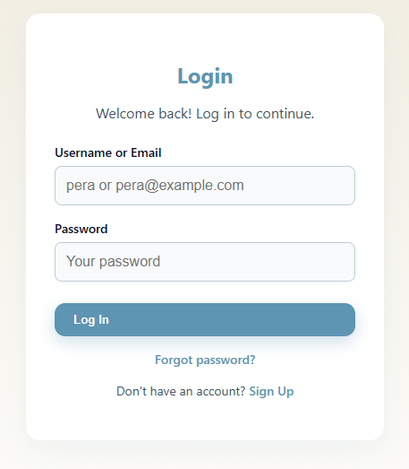
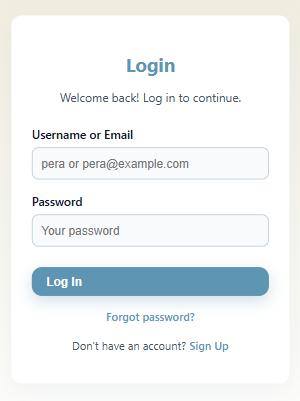
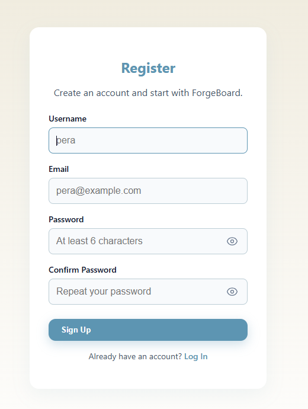
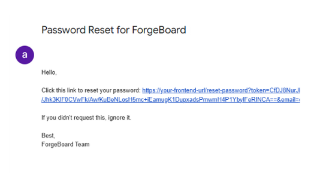

# ForgeBoard — Agile Board & Issue Tracker

> **Private repo:** this repository contains documentation, screenshots and demo materials only. The source code is not public yet.

## Current Status (Auth milestone)
- ✅ API endpoints: **/auth/register**, **/auth/login**, **/auth/forgot-password**, **/auth/reset-password**
- ✅ JWT issuance
- ✅ SMTP wired for password reset (email token, no password)
- ✅ React (.tsx) UI: Login / Register / Forgot / Reset
- ✅ Domain `Users` table mapped to Identity (1:1)
- 🧩 On sign-up: assign **Guest** role (no access until elevated)
- 🧩 Refresh tokens (hashed) + rotation & reuse detection

<h3>📸 Auth — Screens</h3>

<em>Klikni na sliku za full-size.</em>

<!-- LOGIN -->
<table>
  <thead>
    <tr>
      <th align="center">Login — Desktop</th>
      <th align="center">Login — Mobile</th>
    </tr>
  </thead>
  <tbody>
    <tr>
      <td align="center">
        
      </td>
      <td align="center">
        
      </td>
    </tr>
  </tbody>
</table>

 

<!-- REGISTER -->
<table>
  <thead>
    <tr>
      <th align="center">Register — Desktop</th>
      <th align="center">Register — Mobile</th>
    </tr>
  </thead>
  <tbody>
    <tr>
      <td align="center">
        
      </td>
      <td align="center">
        
      </td>
    </tr>
  </tbody>
</table>

 

<!-- FORGOT / RESET (oba desktop) -->
<table>
  <thead>
    <tr>
      <th align="center">Forgot password — Desktop</th>
      <th align="center">Reset password — Desktop</th>
    </tr>
  </thead>
  <tbody>
    <tr>
      <td align="center">
        
      </td>
      <td align="center">
        
      </td>
    </tr>
  </tbody>
</table>

 

<!-- EMAIL TOKEN (puna širina) -->

  
   
  <b>Reset email</b> — token preview

