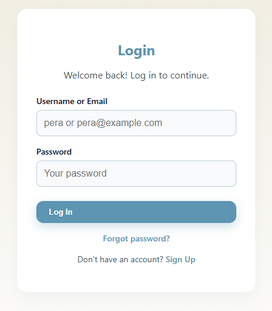
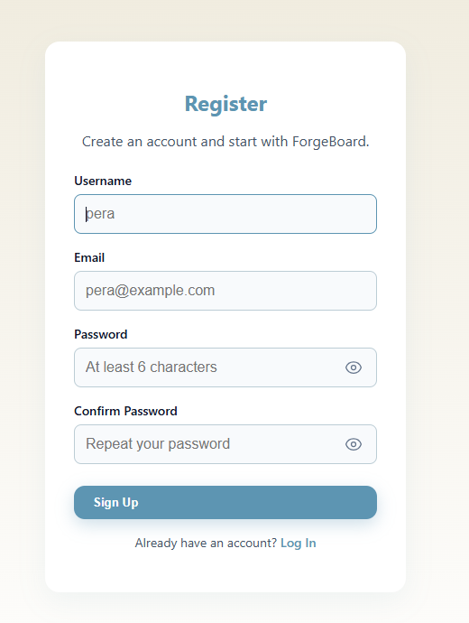
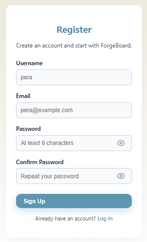
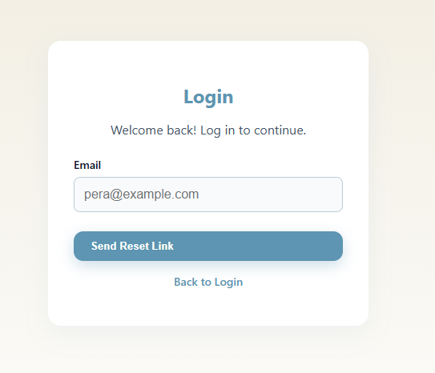

# ForgeBoard — Agile Board & Issue Tracker

ForgeBoard is an Agile board & issue tracker that helps teams plan, track, and deliver work across projects. It provides visual Kanban/Scrum boards, rich task management, notifications, and role-based access so everyone stays aligned and informed.

Key features

Projects & boards: Kanban/Scrum columns, drag & drop, WIP limits

Tasks & subtasks: checklists, due dates, assignees, estimates, labels/priorities

Collaboration: comments, @mentions, attachments

Notifications: in-app and email for important events; optional real-time updates (SignalR)

Backlog & sprints: plan, prioritize, and track progress

Search & filters: quick find by status, labels, assignee, date

Roles & permissions: Admin, Organizer, Participant, Guest

Audit trail: change history for compliance and troubleshooting

Reporting & export: basic reports (burndown/throughput), CSV/PDF export

API-first: .NET Web API backend with a modern React UI

> **Private repo:** this repository contains documentation, screenshots and demo materials only. The source code is not public yet.

## Current Status (Auth milestone)
- ✅ API endpoints: **/auth/register**, **/auth/login**, **/auth/forgot-password**, **/auth/reset-password**
- ✅ JWT issuance
- ✅ SMTP wired for password reset (email token, no password)
- ✅ React (.tsx) UI: Login / Register / Forgot / Reset
- ✅ Domain `Users` table mapped to Identity (1:1)
- 🧩 On sign-up: assign **Guest** role (no access until elevated)
- 🧩 Refresh tokens (hashed) + rotation & reuse detection

<b>📸 Screenshots — klikni za prikaz</b>

 

<b>🔐 Auth screens — klikni za prikaz</b>

 

<table>
<thead>
<tr>
<th align="center">Login — Desktop</th>
<th align="center">Login — Mobile</th>
</tr>
</thead>
<tbody>
<tr>
<td align="center">

</td>
<td align="center">

</td>
</tr>
</tbody>
</table>

 

<table>
<thead>
<tr>
<th align="center">Register — Desktop</th>
<th align="center">Register — Mobile</th>
</tr>
</thead>
<tbody>
<tr>
<td align="center">

</td>
<td align="center">

</td>
</tr>
</tbody>
</table>

 

<table>
<thead>
<tr>
<th align="center">Forgot password — Desktop</th>
</tr>
</thead>
<tbody>
<tr>
<td align="center">

</td>
</tr>
</tbody>
</table>

 

 
<b>Reset email</b> — token preview

<!-- i prazna linija ispod ovog bloka -->

